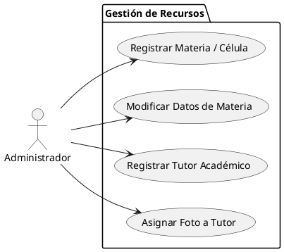
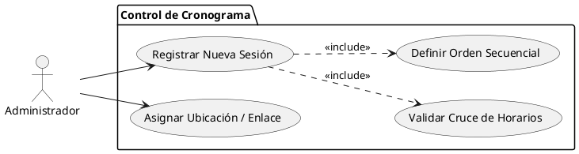
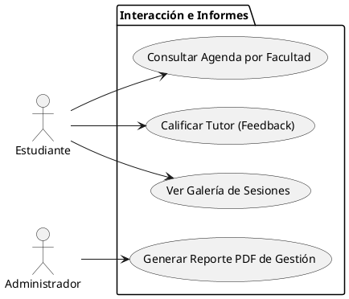
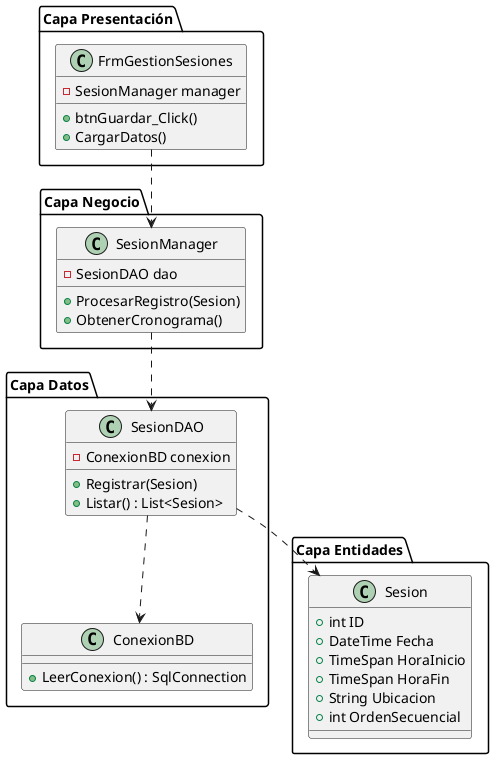
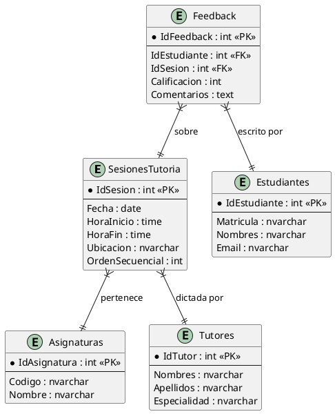

# Documentación Técnica: Proyecto Tutorías POE 2026

Este documento contiene las especificaciones técnicas, diagramas y manuales requeridos para la entrega final del proyecto.

---

## 📊 Documentación UML

### 1. Diagramas de Casos de Uso (Mínimo 3)

#### A. Gestión de Entidades (Administrador)

#### B. Gestión de Horarios y Sesiones (Módulo Central)

#### C. Interacción del Estudiante y Resultados

### 2. Diagrama de Clases (Arquitectura 3-Capas)

### 3. Diagrama de Entidad-Relación (Base de Datos)

---

## 📑 Especificación de Casos de Uso (Detallados)

### CU-01: Registrar Sesión de Tutoría
**Actor:** Administrador
**Descripción:** El administrador ingresa una nueva sesión al cronograma validando disponibilidad.
**Flujo de Pasos:**
1. El Administrador abre el módulo de "Gestión de Sesiones".
2. Selecciona la fecha de la tutoría en el calendario.
3. Ingresa la hora de inicio y la hora de fin.
4. Escribe la ubicación física o el enlace virtual (Zoom/Teams).
5. Hace clic en el botón "Guardar Sesión".
6. El sistema valida que no existan cruces de horario.
7. El sistema calcula el orden secuencial automáticamente.
8. La sesión se muestra en la tabla inferior y se guarda en la base de datos.

### CU-02: Consultar Agenda de Tutorías
**Actor:** Estudiante
**Descripción:** El estudiante busca tutorías disponibles para organizar su semana.
**Flujo de Pasos:**
1. El Estudiante abre la aplicación en el módulo de "Consulta".
2. Selecciona su Facultad o Carrera desde un filtro.
3. El sistema muestra una lista de materias que tienen tutorías programadas.
4. El estudiante hace clic en una materia para ver el detalle.
5. El sistema despliega el nombre del tutor, el horario exacto y el lugar.

### CU-03: Enviar Feedback y Calificación
**Actor:** Estudiante
**Descripción:** Evaluación del servicio de tutoría recibido.
**Flujo de Pasos:**
1. El Estudiante selecciona una sesión a la que asistió.
2. Selecciona una calificación de 1 a 5 estrellas.
3. Escribe un comentario u observación sobre la sesión.
4. Hace clic en "Enviar Calificación".
5. El sistema registra el feedback y lo vincula con el tutor para futuros reportes de desempeño.

---

## 🛠️ Escenarios Prácticos Vinculados

### Escenario 1: Validación de Traslape de Horarios
- **Contexto:** Existe una sesión de "POO" de 09:00 a 10:30.
- **Evento:** El Administrador intenta registrar otra sesión de 10:00 a 11:00 en la misma fecha.
- **Resultado:** El sistema detecta que los 30 minutos finales de la primera chocan con el inicio de la segunda y muestra una alerta: *"Conflicto: Ya existe una tutoría programada en ese rango horario"*. El registro se bloquea.

### Escenario 2: Generación de Reporte de Impacto
- **Contexto:** Se termina el mes y se han realizado 20 tutorías con 50 asistencias registradas.
- **Evento:** El Administrador presiona "Exportar Informe de Gestión".
- **Resultado:** El sistema procesa los datos de la base de datos y genera un archivo PDF detallando la asistencia por materia y el promedio de satisfacción de los estudiantes.

### Escenario 3: Acceso a Recursos Externos
- **Contexto:** Un tutor ha dejado un enlace de grabación de una sesión virtual.
- **Evento:** El Estudiante busca la materia en el calendario y hace clic en la ubicación.
- **Resultado:** El sistema identifica que es una URL y redirige al estudiante al navegador para visualizar el recurso o unirse a la sesión de Zoom/Teams.

---

## 📖 Manual de Usuario Detallado

### 1. Guía de Instalación Paso a Paso

#### Requisitos Previos
- Visual Studio 2022 con la carga de trabajo **"Desarrollo de escritorio de .NET"**.
- SQL Server (LocalDB o Express).
- Git instalado.

#### Proceso de Configuración
1. **Obtener el Código:**
   - Abra una terminal y ejecute: `git clone https://github.com/AdrianP2001/Proyecto_POE.git`
   - Entre a la carpeta y cambie a la rama principal: `git checkout gestion_estudiante` (o la rama master).
2. **Preparar la Base de Datos:**
   - Abra **SQL Server Management Studio (SSMS)**.
   - Conéctese a su servidor (ej. `localhost` o `.\SQLEXPRESS`).
   - Abra el archivo `DB_Global_Tutorias.sql` y presione **F5** para crearlo.
3. **Configurar la Conexión:**
   - Abra el archivo `Proyecto_POE.sln` en Visual Studio.
   - En el "Explorador de Soluciones", abra `App.config`.
   - Modifique el `connectionString`: cambie `Data Source=.` por el nombre de su servidor si es necesario.
4. **Compilación Inicial:**
   - Vaya al menú **Compilar > Recompilar Solución**. Esto descargará las librerías necesarias.

### 2. Guía de Uso del Sistema

#### Registro de Sesiones (Admin)
- Al iniciar, verá el formulario de **Gestión de Sesiones**.
- Use los selectores de fecha y hora para definir el bloque de tiempo.
- En "Ubicación", puede poner un aula física (ej. "Aula 302") o un enlace (ej. `https://zoom.us/...`).
- Presione **Guardar**. Si no hay choques de horario, la sesión aparecerá en la tabla inferior.

#### Consultas y Feedback (Estudiante)
- Use los filtros para localizar su materia.
- Para calificar, use el panel de feedback, seleccione las estrellas y escriba su sugerencia.
- El sistema guardará la hora exacta del registro para asegurar la trazabilidad.

#### Generación de Informes
- En la parte inferior de la pantalla principal, encontrará el botón de **Reporte PDF**.
- Al presionarlo, el sistema le pedirá una ubicación para guardar el archivo con el resumen de gestión.

---

*Documento actualizado según los requerimientos finales de entrega.*
