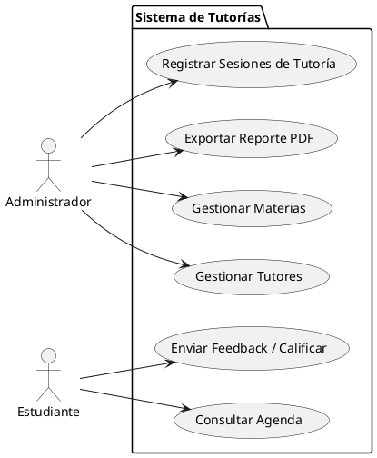
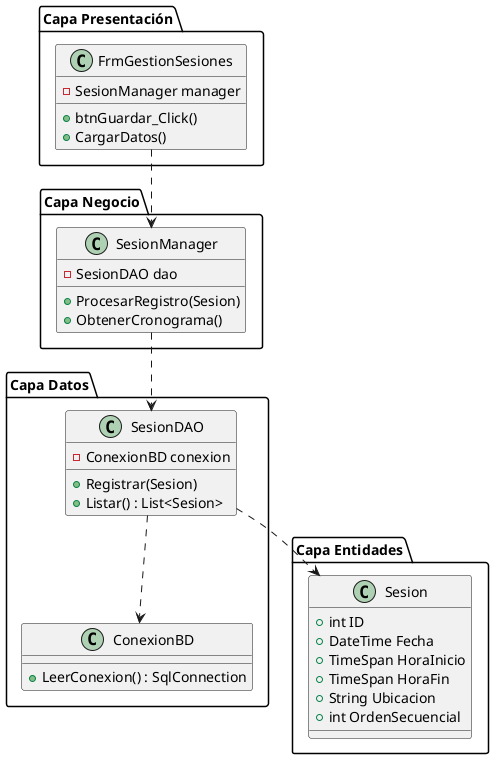
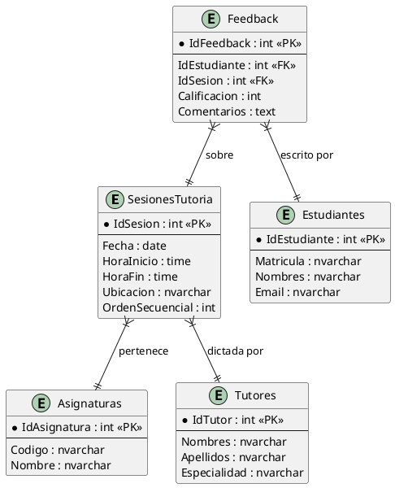

# Documentación Técnica: Proyecto Tutorías POE 2026

Este documento contiene las especificaciones técnicas, diagramas y manuales requeridos para la entrega final del proyecto.

---

## 📊 Documentación UML

### 1. Diagrama de Casos de Uso (PlantUML)

### 2. Diagrama de Clases (Arquitectura 3-Capas)

### 3. Diagrama de Entidad-Relación (Base de Datos)

---

## 📑 Especificación de Casos de Uso

| ID | Caso de Uso | Actor | Descripción |
|:---|:---|:---|:---|
| CU-01 | **Registrar Sesión de Tutoría** | Administrador | Permite crear un horario. El sistema valida automáticamente que no existan cruces en el mismo aula/enlace. |
| CU-02 | **Consultar Agenda** | Estudiante | El estudiante filtra por facultad para ver las tutorías disponibles en la semana. |
| CU-03 | **Enviar Feedback** | Estudiante | Tras asistir a una sesión, el estudiante califica al tutor (1-5 estrellas) y deja un comentario. |

---

## 🛠️ Escenarios Prácticos

### Escenario 1: Conflicto de Horario
- **Precondición:** Existe una tutoría de "Cálculo" de 10:00 a 11:00.
- **Acción:** El admin intenta registrar "Física" de 10:30 a 11:30 en la misma fecha.
- **Resultado esperado:** El sistema muestra un mensaje de error advirtiendo el conflicto y bloquea el registro.

### Escenario 2: Exportación de Informe
- **Acción:** El admin selecciona el botón "Exportar PDF" en el módulo de resultados.
- **Resultado esperado:** Se genera un archivo PDF con el resumen de asistencia e impacto por materia del mes actual.

---

## 📖 Manual de Usuario

### Acceso al Diseñador Visual (Para Desarrolladores)
1. Abrir la solución en Visual Studio.
2. Navegar a `Presentacion > GestionSesiones`.
3. Clic derecho en `FrmGestionSesiones.cs` > **Ver Diseñador**.
4. Use la **Cuadro de Herramientas** (Toolbox) para añadir controles.

### Uso del Sistema
1. **Paso 1:** Configurar la conexión en SQL Server.
2. **Paso 2:** Iniciar la aplicación. Se abrirá por defecto el panel de Gestión de Sesiones.
3. **Paso 3:** Ingrese Fecha, Hora y Ubicación. Haga clic en **Guardar**.
4. **Paso 4:** Observe cómo la lista inferior se actualiza automáticamente con el orden secuencial.

---

*Documento generado para la revisión del Segundo Parcial.*
